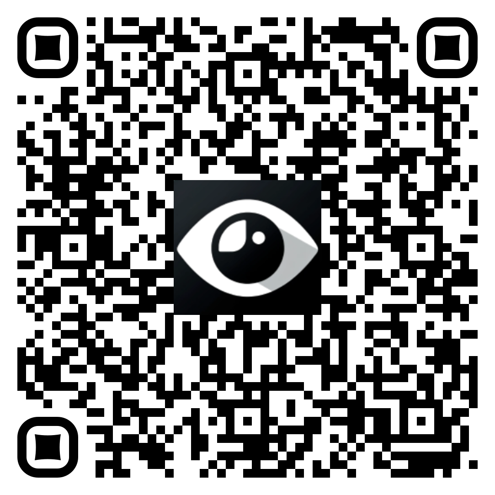

# BlindSightApp

> Prototype Mobile Application

## Our Other Repositories
  

 

## Download (Android)

  
  

### Please Note...
1. We have not yet signed the app with an Android Signing Key, so the tester of the application will have to explicitly allow the installation.
2. This app is currently in alpha release and BlindSight is using an affordable (albeit less powerful) server. We have tested the application with faster servers and the response times have increased drastically. We plan on upgrading our server setup once we have received the needed funding. 

## Usage
Keep your phone level and wait for one of the following instructions:
- `STOP` your path is blocked
- `RIGHT` there is an obstacle in front of you, but the right direction is clear
- `LEFT` there is an obstacle in front of you, but the left direction is clear
  
**NOTE:** User will not receive a direction if the path in front of them is clear.

### Testing
We have conducted testing with students and faculty on our campus. You can find the corresponding footage [here](https://1drv.ms/f/s!AverqHyA6ifYilUTQSp7U406YdyK?e=PSx6aY)

